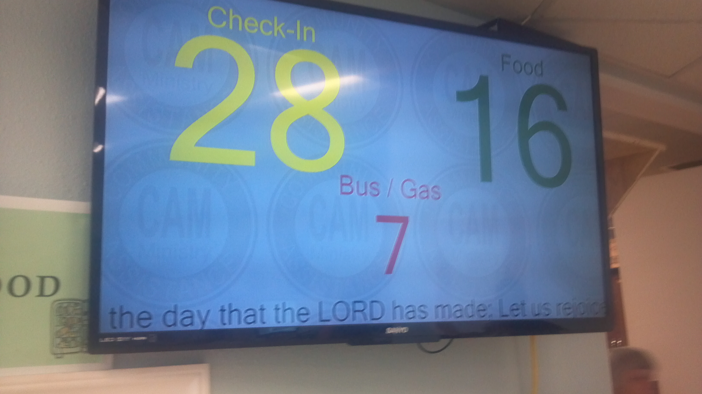

CAM visual display.

 This project is a visual display similar to a supermarket customer counter display.
It was developed for a food bank, so it has relevant text. (editable in source)

 The original deployment is a standard PC and a Big Screen LCD TV.
 The 'server' numbers can be controlled from any workstation with the 'client' software.
 The client is intelligent enough to find the server without configuration.
 
 Latest content in WORK subdir, all others are version controlled (older) copies.
 
 Screen shot below:
 
  
